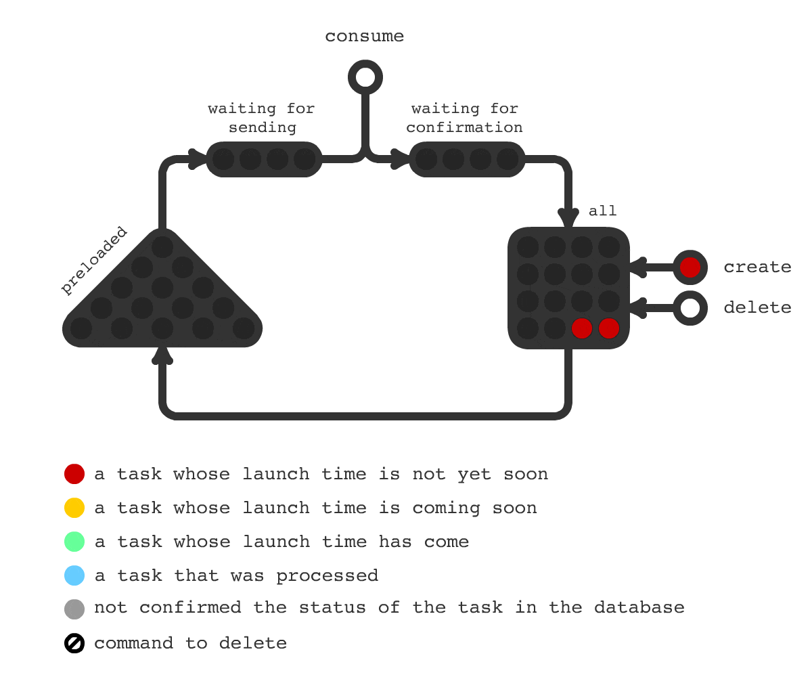

## Trigger Hook - отложенный запуск задач

[](https://travis-ci.com/pvelx/triggerhook)
[](https://github.com/pvelx/triggerhook/releases/latest) 

Часто в проектах возникает необходимость выполнения отложенных задач, таких как отправка email, push и тп. 
При наступления времени выполнения задачи, Trigger Hook посылает триггер на запуск.
Акцент данной библиотеки делается на выполнение единичных задач в определенное время.
Данная библиотека делает только одно - сообщает когда нужно запустить задачу. 

### Принцип работы



- При создании задачи она попадает в базу данных (квадратный блок).
- В оперативную память подгружаются задачи (на схеме треугольный блок), 
если время запуска менее чем через 5 секунд (по умолчанию).
- При наступлении времени (exec time) отправляется триггер на выполнение задачи.
- В случае успешной отправки триггера задача удаляется из базы данных. 

На схеме перед и после отправки триггера показаны буферы для для задач. 
Буфер перед отправкой нужен когда пропускная способность канала отправки триггера ограничена.
Буфер после нужен для компенсации краткосрочной, 
пиковой нагрузки в случае если скорость подтверждения будет меньше скрости отправки.

На схеме представленны некоторые из метрик приложения:

Метрика  | Описание
------------------|----------------------
All|Общее количество задач
Waiting for confirmation | Количество задач ожидающих подтверждения после отправки. Последний этап работы с задачей. Чем меньше значение тем лучше. Наличие задач в данной метрике говорит о замедленной работе с базой данных.
Confirmation rate | Скорость подтверждения задач после отправки.
Preloaded | Количество задач предзагруженных в оперативную память.
Preloading rate | Количество задач подгруженных за единицу времени
Waiting for sending | Количество задач достигших времени выполнения и ожидающих отправки обработчику. Чем меньше значение тем лучше. Наличие задач в данной метрике говорит о пониженной пропускной способности обработчика задач.
Creating rate | Количество созданных задач (через метод Create) за единицу времени
Deleting rate | Количество удаленных задач (через метод Delete) за единицу времени 
Sending rate | Количество обработанных задач (через метод Consume) за единицу времени 


### Особенности:
- Лаконичный API.
- Выполнение задач с секундной точностью.
- Большая производительность отправки задач на выполнение. Достигается за счет простой схемы хранения задач, индексирования и многопоточного доступа к базе данных.
- Еще бОльшая краткосрочная производительность. Задачи, время выполнения которых скоро наступит, подгружаются в оперативную память заранее. Это особенно важно, например, если в на одно время назначено выполнение нескольких сотен тысяч задач. 
- Система обладает стойкостью (durability) к сбоям. Только после выполнения задачи из базы данных удаляется задача. Это гарантирует отправку задачи на выполнение. Внезапное остановка приложения не приведет к несогласованности данных в базе данных.
- Заточен под микро-сервисную, событийно ориентированную архитектуру. Легко поместить в контейнер. Легко реализовать полностью асинхронный API.
- Модульная структура библиотеки. Легко можно заменить какую либо часть своей реализацией. 
- Мониторинг состояния приложения. Встроенный адаптер мониторинга показателей производительности. Встроенный адаптер для логирования ошибок.

### Требования

Проект использует базу данных MySql версий 5.7 или 8

### Быстрый старт

Методы Create, Delete, Consume безопасны при использовании в нескольких горутинах.

```go
package main

import (
	"fmt"
	"log"
	"time"

	"github.com/pvelx/triggerHook"
	"github.com/pvelx/triggerHook/connection"
	"github.com/pvelx/triggerHook/domain"
	"github.com/satori/go.uuid"
)

func send(id string, execTime int64) error {
	// You have to trigger task in your app
	fmt.Printf("Task id:%s execTime:%d\n", id, execTime)
	return nil
}

func main() {
	tasksDeferredService := triggerHook.Build(triggerHook.Config{
		Connection: connection.Options{
			Host: "127.0.0.1:3306",
		},
	})

	go func() {
		for i := 0; i < 1000; i++ {
			task := domain.Task{
				Id:       uuid.NewV4().String(),
				ExecTime: time.Now().Add(time.Minute).Unix(),
			}
			if err := tasksDeferredService.Create(&task); err != nil {
				log.Fatalf("error creating task: %v", err)
			}

			// Delete each tenth task
			if i%10 == 0 {
				if err := tasksDeferredService.Delete(task.Id); err != nil {
					log.Fatalf("error deleting task: %v", err)
				}
			}
		}
	}()

	go func() {
		for {
			result := tasksDeferredService.Consume()
			task := result.Task()
			if err := send(task.Id, task.ExecTime); err != nil {
				result.Rollback()
			}
			result.Confirm()
		}
	}()

	if err := tasksDeferredService.Run(); err != nil {
		log.Fatalf("failed run trigger hook: %v", err)
	}
}
```


#### Внимание!
В случае аварийного завершения приложения, есть вероятность, что выполнение некоторых задач может быть не подтверждено в базе данных. 
При повторном запуске приложения эти задачи будут отправлены на выполнение повторно. 
Такое поведение является компромиссом в пользу обеспечения стойкости к сбоям. 
Ваше приложение должно игнорировать повторное получение триггеров на обработку.


## License

This project is licensed under the MIT License - see the [LICENSE](LICENSE) file for details
