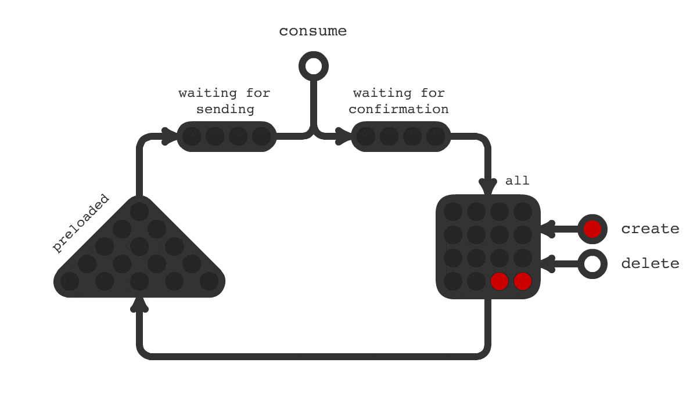

## Trigger Hook - delayed launch of tasks

[](https://travis-ci.com/pvelx/triggerhook)
[](https://github.com/pvelx/triggerhook/releases/latest) 

Often in projects, there is a need to perform deferred tasks, 
such as sending email, push, and other tasks specific to the domain area of your application. 
Difficulties begin when the usual crontab is no longer enough, 
when batch processing is not suitable, when each task unit has its own execution time or it is assigned dynamically.
To solve this problem, a Trigger Hook was created. You can build a task scheduler based on this library.

### Principle of operation



Task  | Description
------------------|----------------------
|a task whose launch time is not yet soon
|a task whose launch time is coming soon
|a task whose launch time has come
|a task that was processed
|not confirmed the status of the task in the database
|command to delete


Life cycle tasks:
- When creating a task, it gets into the database (square block) (red and yellow).
- Tasks are loaded into memory (triangular block) if their start time is coming soon (red->yellow). 
This structure is implemented in the form of a prioritized queue (heap).
- When the task execution time comes, it is sent for execution (yellow->green). 
An intermediate buffer is used before processing to compensate for peak loads.
- If the task is successfully submitted, it is deleted from the database (green->blue). 
An intermediate buffer is used before deletion, also to compensate for peak loads.


The diagram shows some of the application metrics:

Metric  | Description
------------------|----------------------
All|Total number of tasks
Creating rate | Number of created tasks (via the Create method) per unit of time.
Deleting rate | Number of deleted tasks (via the Delete method) per unit of time. 
Sending rate | The number of processed tasks (via the Consume method) per unit of time.
Preloaded | The number of tasks preloaded into memory.
Preloading rate | The number of tasks loaded per unit of time.
Waiting for sending | The number of tasks that have reached the execution time and are waiting to be sent to the consumer. The lower the value, the better. The presence of tasks in this metric indicates a reduced capacity of the task consumer.
Waiting for confirmation | The number of tasks waiting for confirmation after sending. The last stage of working with the task. The lower the value, the better. The presence of tasks in this metric indicates slow work with the database.
Confirmation rate | The number of confirmed tasks after sending per unit of time.


### Features:
- Simple API.
- Performing tasks with second precision.
- High performance of sending tasks for execution. This is achieved through a simple task storage scheme, indexing, and multithreaded database access.
- High peak performance. Tasks that will be completed soon are loaded into memory in advance. This is especially important, for example, if several hundred thousand tasks are assigned at one time. 
- The system is durable to failures. Only after the task is completed, the task is deleted from the database. This ensures that the task is sent for execution. The sudden stop of the application will not lead to inconsistent data in the database.
- It is designed for a micro-service, event-driven architecture. It is easy to implement a fully asynchronous API.
- The modular structure of the library. You can easily replace any part with your own implementation.
- Monitoring the status of the application. Built-in performance monitoring adapter. Built-in adapter for error logging.

### Requirements

The project uses a MySQL database version 5.7 or 8

### Quick start

The Create, Delete, and Consume methods are safe when used in multiple goroutines.

```go
package main

import (
	"fmt"
	"log"
	"time"

	"github.com/pvelx/triggerHook"
	"github.com/pvelx/triggerHook/connection"
	"github.com/pvelx/triggerHook/domain"
	"github.com/satori/go.uuid"
)

func send(id string, execTime int64) error {
	// You have to trigger task in your app
	fmt.Printf("Task id:%s execTime:%d\n", id, execTime)
	return nil
}

func main() {
	tasksDeferredService := triggerHook.Build(triggerHook.Config{
		Connection: connection.Options{
			Host: "127.0.0.1:3306",
		},
	})

	go func() {
		for i := 0; i < 1000; i++ {
			task := domain.Task{
				Id:       uuid.NewV4().String(),
				ExecTime: time.Now().Add(time.Minute).Unix(),
			}
			if err := tasksDeferredService.Create(&task); err != nil {
				log.Fatalf("error creating task: %v", err)
			}

			// Delete each tenth task
			if i%10 == 0 {
				if err := tasksDeferredService.Delete(task.Id); err != nil {
					log.Fatalf("error deleting task: %v", err)
				}
			}
		}
	}()

	go func() {
		for {
			result := tasksDeferredService.Consume()
			task := result.Task()
			if err := send(task.Id, task.ExecTime); err != nil {
				result.Rollback()
			}
			result.Confirm()
		}
	}()

	if err := tasksDeferredService.Run(); err != nil {
		log.Fatalf("failed run trigger hook: %v", err)
	}
}
```

If the application crashes, there is a possibility that some tasks may not be confirmed in the database.
When you restart the application, these tasks will be sent for execution again.
This behavior is a trade-off in favor of providing fault tolerance.
When your application receives a message from Trigger Hook, it should only execute the task once, and ignore it when it receives it again.

## License

This project is licensed under the MIT License - see the [LICENSE.md](LICENSE.md) file for details