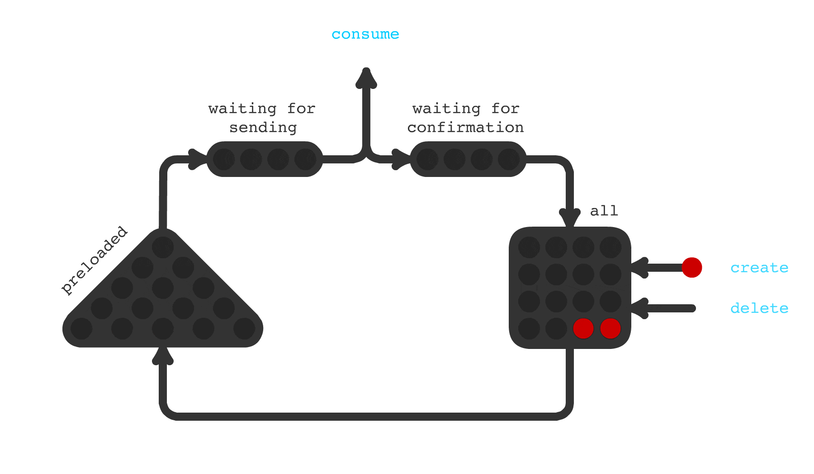

## Trigger Hook - отложенный запуск задач

[](https://travis-ci.com/pvelx/triggerhook)
[](https://github.com/pvelx/triggerhook/releases/latest) 

Часто в проектах возникает необходимость выполнения отложенных задач, таких как отправка email, push и других специфических задач, свойственных доменной области вашего приложения. 
Trigger Hook поможет вам в реализации механизма отложенного выполнения задач.


При наступления времени выполнения задачи, Trigger Hook посылает триггер на выполнение вашему приложению по каналу (асинхронному или синхронному).

Акцент данной библиотеки делается на выполнение единичных задач в определенное время.


### Принцип работы



### Быстрый старт

```go
package main

import (
	"fmt"
	"github.com/pvelx/triggerHook"
	"github.com/pvelx/triggerHook/connection"
	"github.com/pvelx/triggerHook/domain"
	"github.com/satori/go.uuid"
	"log"
	"time"
)

func send(id string, execTime int64) error {
	// You have to trigger task in your app
	fmt.Printf("Task id:%s execTime:%d\n", id, execTime)
	return nil
}

func main() {
	tasksDeferredService := triggerHook.Build(triggerHook.Config{
		Connection: connection.Options{
			Host: "127.0.0.1:3306",
		},
	})

	go func() {
		for {
			time.Sleep(time.Second)
			task := domain.Task{
				Id:       uuid.NewV4().String(),
				ExecTime: time.Now().Add(time.Minute).Unix(),
			}
			if err := tasksDeferredService.Create(&task); err != nil {
				log.Fatalf("error creating task: %v", err)
			}
		}
	}()

	go func() {
		for {
			result := tasksDeferredService.Consume()
			task := result.Task()
			if err := send(task.Id, task.ExecTime); err != nil {
				result.Rollback()
			}
			result.Confirm()
		}
	}()

	if err := tasksDeferredService.Run(); err != nil {
		log.Fatalf("failed run trigger hook: %v", err)
	}
}
```


Отсутствие возможности передачи некоторой полезной нагрузки при создании задачи может некоторых разочаровать. 
Но уверяю, в этом нет необходимости. 
Данная библиотека делает только одно - сообщает когда нужно запустить задачу. Для этого библиотеке нужен только id задачи и время выполнения. Относитесь к trigger hook как к слою абстракции, находящегося ниже приложения, которое его использует. Полная информация о задаче, например, тип, статус, время исполнения, количество попыток выполнения, полезная нагрузка и тп, будут содержаться в слое абстракции выше Trigger Hook. В примере это продемонстрировано. 


### Особенности:
- Лаконичный API.
- Выполнение задач с секундной точностью.
- Большая производительность отправки задач на выполнение. Достигается за счет простой схемы хранения задач, индексирования и многопоточного доступа к базе данных.
- Еще бОльшая краткосрочная производительность. Задачи, время выполнения которых скоро наступит, подгружаются в оперативную память. Это особенно важно, если например, если в на одно время назначено выполнение нескольких сотен тысяч задач. 
- Система обладает стойкостью (durability) к сбоям. Только после выполнения задачи из базы данных удаляется задача. Это гарантирует отправку задачи на выполнение. Внезапное остановка приложения не приведет к несогласованности данных в базе данных.
- Заточен под микро-сервисную, событийно ориентированную архитектуру. Легко поместить в контейнер. Легко реализовать полностью асинхронный API.
- Модульная структура библиотеки. Легко можно заменить какую либо часть своей реализацией. 
- Мониторинг состояния приложения. Встроенный адаптер мониторинга показателей производительности. Встроенный адаптер для логирования ошибок.


#### Внимание!
В случае аварийного завершения приложения, есть вероятность, что выполнение некоторых задач может быть не подтверждено в базе данных. При повторном запуске приложения эти задачи будут отправлены на выполнение повторно. Такое поведение является компромиссом в пользу обеспечения стойкости к сбоям. Ваше приложение должно выполнять задачу только один раз, а при повторном получении - игнорировать.


## License

This project is licensed under the MIT License - see the [LICENSE.md](LICENSE.md) file for details